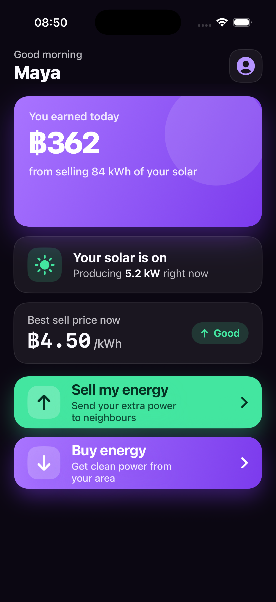
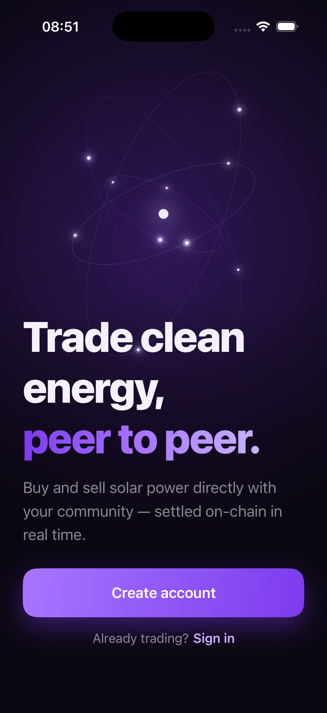
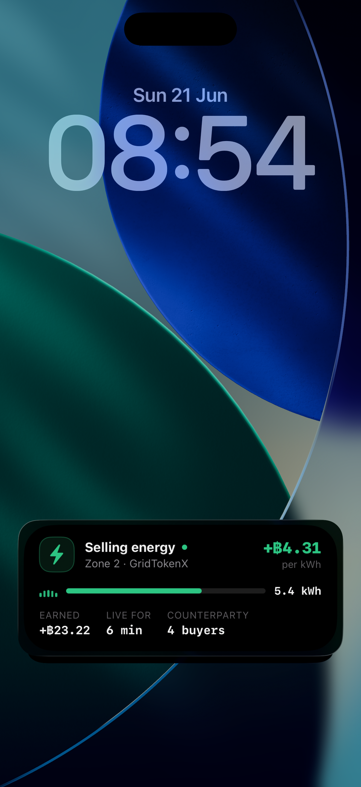
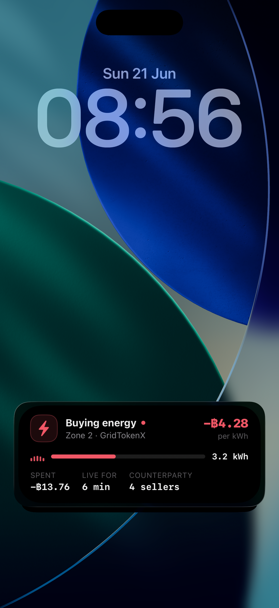
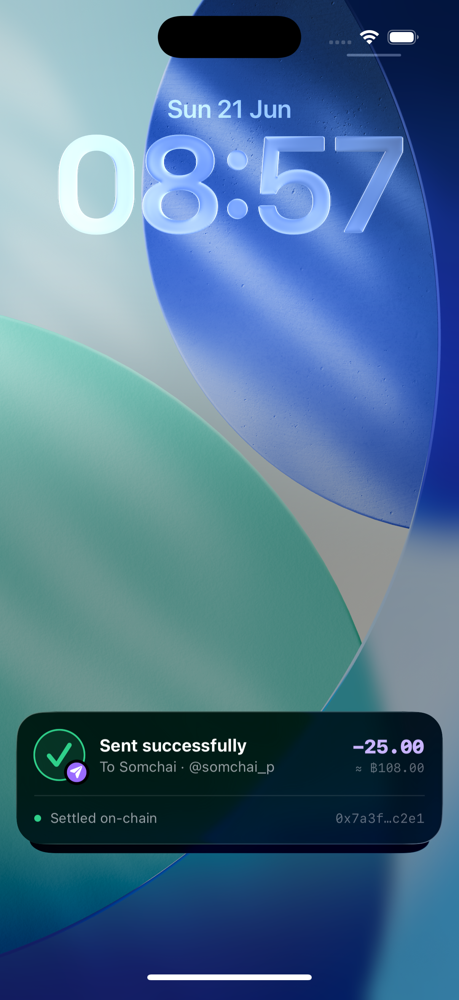
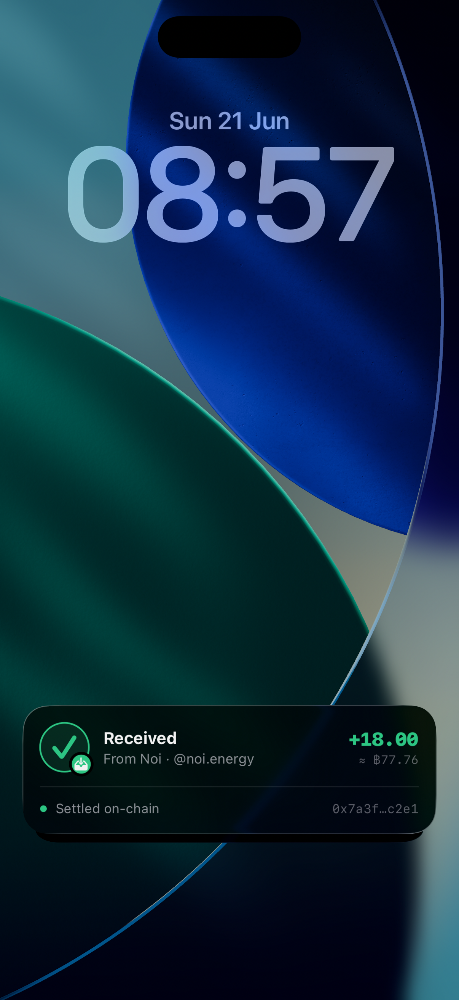
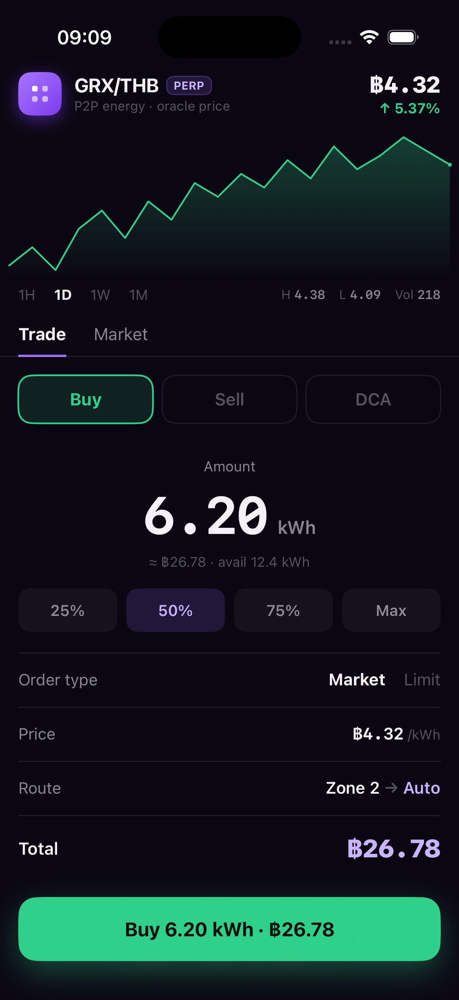

# GridTokenX iOS

Native SwiftUI app for **GridTokenX** — a peer-to-peer clean-energy trading concept. Ported screen-by-screen from the HTML/JSX prototypes in [`mock-ui/`](mock-ui/).

- **Bundle ID:** `gridtokenx.gridtokexios`
- **Deployment target:** iOS 26.5, universal (iPhone + iPad)
- **Language:** Swift 5.0 · SwiftUI
- **Tests:** Swift Testing (`import Testing`) for unit; XCUITest for UI flows

## Screenshots

<p align="center">
  
  
  
  
  
  
  
</p>

## Features

A multi-screen signup flow plus a dashboard with a set of post-login feature screens.

**Signup flow:** Welcome → Create account → Verify email → Profile + role → Success → Dashboard

**Post-login (reached from the dashboard):**

- **Profile & Wallet** — portfolio hero, token holdings / activity tabs, account settings; Send / Deposit fire a transaction-receipt island.
- **Settings & Profile edit** — account settings and editable profile.
- **Billing** — billing overview + history.
- **DCA** — dollar-cost-average buy plan.
- **Energy flow** — energy-flow and "my home" flow visualizations.
- **Grid map** — peer / grid map view.
- **NDID** — Thai NDID identity + profile.
- **Orders** — order history.
- **Transfer** — deposit / withdraw.
- **Register device** · **Notifications** · **Receipt** (expanded sent-success artboard).
- **Dynamic Island / Live Activities** — live energy-trade island (sell/buy) and transaction-receipt island (send/receive), rendered via ActivityKit.
- **User notifications** — local `UNUserNotificationCenter` banners; taps deep-link into the wallet.

No persistence layer yet — each screen drives itself with local `@State`; navigation lives in `RootView`.

## Project layout

```
gridtokexios/
├── App/            composition root — gridtokexiosApp.swift, RootView.swift (router)
├── DesignSystem/   GTXDesignTokens.swift, GTXComponents.swift, GTXKit.swift
├── Features/       one folder per screen group
│   ├── Welcome/  Onboarding/  Dashboard/  Profile/  Settings/  Billing/
│   ├── DCA/  EnergyFlow/  GridMap/  NDID/  Orders/  Transfer/
│   └── Register/  Notifications/  Receipt/
├── Core/           cross-cutting infra — Inject.swift, Notifications/
└── Resources/      Assets.xcassets

EnergyIslandWidget/  app-extension target hosting the Dynamic Island / lock-screen
                     Live Activities (energy trade + TX receipt)

mock-ui/             HTML/JSX design prototypes — the source of truth for the UI
```

The app target uses an Xcode **synchronized folder group**, so files added under `gridtokexios/` auto-map to the build. The `EnergyIslandWidget/` group uses explicit file references — new files there are registered via the idempotent Ruby scripts in [`scripts/`](scripts/).

## Build & run

Scheme is `gridtokexios`. Adjust the simulator `name` to one installed locally (`xcrun simctl list devices`).

```bash
# Build
xcodebuild build -project gridtokexios.xcodeproj -scheme gridtokexios \
  -destination 'platform=iOS Simulator,name=iPhone 17'

# Run all tests (unit + UI)
xcodebuild test -project gridtokexios.xcodeproj -scheme gridtokexios \
  -destination 'platform=iOS Simulator,name=iPhone 17'
```

Day-to-day, build/run via Xcode (⌘B / ⌘R / ⌘U).

### Debug launch hooks (DEBUG builds)

Pass as launch arguments to jump straight to a state:

| Arg | Effect |
| --- | --- |
| `START_ISLAND` / `START_ISLAND_BUY` | sample energy Live Activity (sell / buy) |
| `TX_ISLAND` / `TX_ISLAND_RX` | sample TX-receipt island (send / receive) |
| `SEND_NOTIF` | sample local notification (taps deep-link to wallet) |
| `SHOW_WALLET` | jump to Profile & Wallet |
| `SHOW_SENT` | jump to the in-app sent-success receipt screen |
| `UITEST` | render a static Welcome frame for XCUITest |

## Notes

- Source-file date headers use Buddhist-era years (BE) — Thai locale, cosmetic.
- Local notifications need a one-time "Allow" tap granted manually in the simulator.
